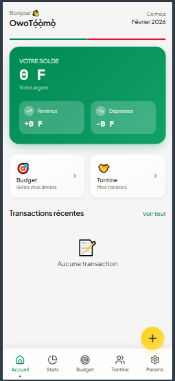

# 🏦 OwoTọ́ọ̀mọ̀ - Gestionnaire Financier Personnel

<div align="center">
  
</div>

> **Créé par**: Eucher ABATTI

Un application mobile-first de gestion financière complète avec support multilingue, système de tontine traditionnel, et gestion avancée des budgets.

## 📱 À propoUn application mobile-first de gestion financière complète avec support multilingue, système de tontine traditionnel, et gestion avancée des budgets.

## 📱 À propos

**OwoTọ́ọ̀mọ̀** (prononcé "Owo Tô Mô") est une application de gestion financière conçue pour les Africains de l'Ouest, permettant de:

- ✅ **Tracker ses finances** - Enregistrer revenus et dépenses
- ✅ **Gérer des budgets** - Définir des limites par catégorie
- ✅ **Organiser des tontines** - Gérer des groupes d'épargne collective
- ✅ **Exporter ses données** - Télécharger en CSV ou JSON
- ✅ **Sécuriser ses données** - Protection par PIN et masquage de solde
- ✅ **Support multilingue** - 6 langues: Français, Yoruba, Anglais, Espagnol, Allemand, Chinois

## 🚀 Caractéristiques principales

### 💰 Gestion Financière
- Enregistrement des transactions (revenus/dépenses)
- Catégorisation automatique des dépenses
- Historique complet des transactions
- Calcul du solde en temps réel
- Visualisation des dépenses par catégorie

### 📊 Budgets intelligents
- Définir des limites de budget par catégorie
- Suivi de la progression en temps réel
- Alertes quand le budget est dépassé
- Comparaison revenu/dépense mensuel

### 🤝 Système de Tontine
La tontine est un système d'épargne collective traditionnel. Voici comment ça fonctionne:

1. **Créer un groupe** - Définir le montant de cotisation et la fréquence
2. **Ajouter des membres** - Inviter les participants avec avatars
3. **Cotiser régulièrement** - Enregistrer les paiements des membres
4. **Bénéficiaires** - Un ordre de bénéficiaires reçoit le pot collecté
5. **Avancer les tours** - Passer automatiquement au tour suivant

**Fonctionnalités:**
- ✅ Suivi en temps réel des paiements
- ✅ Alertes pour les impayés
- ✅ Gestion automatique des tours
- ✅ Suppression de tontines
- ✅ Historique complet

### 🔐 Sécurité
- Protection par code PIN (4-6 chiffres)
- Masquage du solde d'affichage
- Données chiffrées en localStorage
- Biometric ready (préparé pour iOS/Android)

### 📤 Export de données
- Export CSV compatible Excel
- Export JSON pour sauvegarde
- Sélection des données à exporter
- Cloud sync ready (préparé)

### 🌍 Multilingue
Prend en charge 6 langues:
- 🇫🇷 Français
- 🇳🇬 Yoruba (Yorùbá)
- 🇬🇧 English
- 🇪🇸 Español
- 🇩🇪 Deutsch
- 🇨🇳 简体中文

Détection automatique selon la langue du navigateur, avec stockage des préférences.

### 🔔 Notifications
- Confirmation de transactions
- Alertes de dépenses limites
- Rappels quotidiens
- Notifications de paiements tontine

## 🛠️ Stack Technique

| Technologie | Usage |
|------------|-------|
| **React 18** | Framework UI |
| **TypeScript** | Type-safety |
| **Vite** | Bundler & Dev server |
| **TailwindCSS** | Styling |
| **Zustand** | State management |
| **react-i18next** | Internationalisation |
| **Framer Motion** | Animations |
| **shadcn/ui** | Composants UI |
| **Sonner** | Toast notifications |
| **Lucide React** | Icons |

## 📦 Installation

### Prérequis
- Node.js 18+
- npm ou bun

### Étapes

```bash
# Cloner le projet
git clone <repository-url>
cd OwoTọ́ọ̀mọ̀

# Installer les dépendances
npm install

# Démarrer le serveur de développement
npm run dev

# Ouvrir http://localhost:8080
```

### Build pour production
```bash
npm run build
npm run preview
```

## 📂 Structure du projet

```
src/
├── components/              # Composants React
│   ├── AddTransactionSheet.tsx      # Formulaire d'ajout transaction
│   ├── AddTontineSheet.tsx          # Créer une tontine
│   ├── AddTontineMembersSheet.tsx   # Ajouter des membres
│   ├── TontinePaymentDialog.tsx     # Dialog de paiement
│   ├── TontineActions.tsx           # Gestion tontine (suppr, avancer)
│   ├── TontineCard.tsx              # Affichage tontine
│   ├── BalanceCard.tsx              # Affichage solde
│   ├── BudgetCard.tsx               # Gestion budgets
│   ├── LanguageSelector.tsx         # Sélecteur de langue
│   ├── NotificationsSettings.tsx    # Paramètres notifications
│   ├── SecuritySettings.tsx         # Paramètres sécurité
│   ├── ExportSettings.tsx           # Export de données
│   └── ui/                          # Composants shadcn
├── pages/                   # Pages principales
│   ├── Dashboard.tsx               # Accueil
│   ├── TontinePage.tsx             # Gestion tontines
│   ├── BudgetsPage.tsx             # Gestion budgets
│   ├── StatsPage.tsx               # Statistiques
│   ├── SettingsPage.tsx            # Paramètres
│   └── NotFound.tsx                # 404
├── store/
│   └── useStore.ts          # Zustand store (state management)
├── types/
│   └── index.ts             # Définitions TypeScript
├── lib/
│   ├── format.ts            # Utilitaires de formatage
│   └── utils.ts             # Utilitaires généraux
├── data/
│   └── categories.ts        # Catégories de transactions
├── locales/                 # Fichiers de traduction (6 langues)
│   ├── fr.json
│   ├── en.json
│   ├── yo.json
│   ├── es.json
│   ├── de.json
│   └── zh.json
├── i18n.ts                  # Configuration i18next
├── App.tsx                  # Composant racine
├── main.tsx                 # Point d'entrée
└── index.css                # Styles globaux
```

## 💡 Utilisation

### Ajouter une transaction
1. Cliquez sur le bouton **+** en bas
2. Sélectionnez le type (revenu/dépense)
3. Choisissez la catégorie
4. Entrez le montant et la description
5. Confirmez

### Créer une tontine
1. Allez dans "Àwọn Àjọ Mi" (Mes tontines)
2. Cliquez sur le bouton **+**
3. Remplissez: nom, montant, fréquence, nombre de tours
4. Créez la tontine

### Ajouter des membres
1. Cliquez sur la tontine créée
2. Cliquez sur l'icône **👥**
3. Ajoutez chaque membre avec son nom et avatar
4. Confirmez

### Enregistrer un paiement
1. Ouvrez la tontine
2. Cliquez sur un membre
3. Dialog de paiement s'affiche
4. Cliquez **"Marquer payé"**
5. Le montant est enregistré

### Avancer au tour suivant
1. Dans la tontine, voir la section "Progression du tour"
2. Quand tous ont payé, bouton **"Avancer au tour suivant"** s'active
3. Le nouveau bénéficiaire est assigné automatiquement

## 🔧 Configurations

### Variables d'environnement
Aucune variable d'environnement requise. Tout fonctionne en localStorage.

### Stockage des données
- **localStorage key**: `app-state`
- **Format**: JSON chiffré en Base64
- **Données persistantes**: Transactions, budgets, tontines, paramètres

## 🚨 Limitations connues

1. **Biometric** - Préparé dans l'UI mais non implémenté
2. **Cloud sync** - Interface prête, non implémenté
3. **PDF export** - Seulement CSV/JSON pour l'instant
4. **Modification tontine** - Bouton prêt, pas d'implémentation complète

## 🐛 Troubleshooting

### Port 8080 déjà utilisé
```bash
# Vite essaiera automatiquement le port 8081, 8082, etc.
# Ou terminez les processus node actifs
Get-Process node | Stop-Process -Force
```

### Données supprimées par erreur
- Les données sont stockées dans `localStorage`
- Inspectez-les: F12 → Application → Local Storage
- Vous pouvez récupérer depuis le backup si disponible

### Langue ne change pas
1. Videz le cache: Ctrl+Shift+Delete
2. Actualisez: F5
3. Vérifiez localStorage pour `preferredLanguage`

## 📊 Performance

- **Bundle size**: ~950 KB (minifié), ~290 KB (gzip)
- **Première visite**: ~2-3 secondes
- **Chargement suivant**: <1 seconde (cache)
- **Mobile-first**: Optimisé pour écrans < 768px

## 🤝 Contribution

Les contributions sont bienvenues!

1. Fork le projet
2. Créez une branche (`git checkout -b feature/AmazingFeature`)
3. Commit vos changements (`git commit -m 'Add some AmazingFeature'`)
4. Push vers la branche (`git push origin feature/AmazingFeature`)
5. Ouvrez une Pull Request

## 📝 Licence

Ce projet est sous licence MIT. Voir [LICENSE](LICENSE) pour plus de détails.

## 👨‍💻 Créateur

**Eucher ABATTI**

- Portfolio: [À ajouter]
- Email: [À ajouter]
- GitHub: [À ajouter]

## 🙏 Remerciements

- Inspiré par les traditions d'épargne collective africaines
- UI/UX basée sur des principes mobile-first
- Communauté React et développeurs open-source

## 📞 Support

Pour toute question ou problème:
1. Vérifiez les [Issues](issues) existantes
2. Créez une nouvelle issue avec une description détaillée
3. Mentionnez votre navigateur et système d'exploitation

---

**Faites bon usage de OwoTọ́ọ̀mọ̀! 🌟**

*Gestion financière simple, sécurisée et accessible pour tous.*

The only requirement is having Node.js & npm installed - [install with nvm](https://github.com/nvm-sh/nvm#installing-and-updating)

Follow these steps:

```sh
# Step 1: Clone the repository using the project's Git URL.
git clone <YOUR_GIT_URL>

# Step 2: Navigate to the project directory.
cd <YOUR_PROJECT_NAME>

# Step 3: Install the necessary dependencies.
npm i

# Step 4: Start the development server with auto-reloading and an instant preview.
npm run dev
```

**Edit a file directly in GitHub**

- Navigate to the desired file(s).
- Click the "Edit" button (pencil icon) at the top right of the file view.
- Make your changes and commit the changes.

**Use GitHub Codespaces**

- Navigate to the main page of your repository.
- Click on the "Code" button (green button) near the top right.
- Select the "Codespaces" tab.
- Click on "New codespace" to launch a new Codespace environment.
- Edit files directly within the Codespace and commit and push your changes once you're done.

## What technologies are used for this project?

This project is built with:

- Vite
- TypeScript
- React
- shadcn-ui
- Tailwind CSS

## How can I deploy this project?

Simply open [Lovable](https://lovable.dev/projects/REPLACE_WITH_PROJECT_ID) and click on Share -> Publish.

## Can I connect a custom domain to my Lovable project?

Yes, you can!

To connect a domain, navigate to Project > Settings > Domains and click Connect Domain.

---

## 💰 Soutenir le Projet

**OwoTọ́ọ̀mọ̀** est un projet créé bénévolement pour la communauté. Si vous souhaitez contribuer financièrement ou rejoindre l'équipe de développement pour faire évoluer l'application, veuillez nous contacter!

### 📞 Nous Contacter

**Pour les donations et contributions:**

- 📧 **Email:** [abattieucher@gmail.com](mailto:abattieucher@gmail.com)
- 📱 **WhatsApp/Téléphone:** [+229 57 00 24 27](tel:+2290157002427)

### 💡 Comment Contribuer

1. **Donation financière** - Aider au financement des serveurs et déploiement
2. **Contribution au code** - Rejoindre l'équipe de développement
3. **Feedback & suggestions** - Nous aider à améliorer l'app
4. **Partage & promotion** - Faire connaître OwoTọ́ọ̀mọ̀ à votre réseau

**Tous les contributeurs seront reconnus dans l'application et dans le projet!** 🌟

Ensemble, nous pouvons faire de **OwoTọ́ọ̀mọ̀** une application exceptionnelle pour tous les Africains de l'Ouest! 🌍

---

## 📞 Support & Contact

Pour toute question, suggestion ou problème:

- 📧 **Email:** [abattieucher@gmail.com](mailto:abattieucher@gmail.com)
- 📱 **WhatsApp:** [+229 57 00 24 27](tel:+22957002427)
- 🐛 **Issues GitHub:** [Créer une issue](issues)

---

## 🙏 Remerciements

Un grand merci à tous ceux qui soutiennent **OwoTọ́ọ̀mọ̀** et contribuent à son évolution!

**Faites bon usage de OwoTọ́ọ̀mọ̀!** 🌟

*Gestion financière simple, sécurisée et accessible pour tous.*

Créé avec ❤️ par **Eucher ABATTI**
